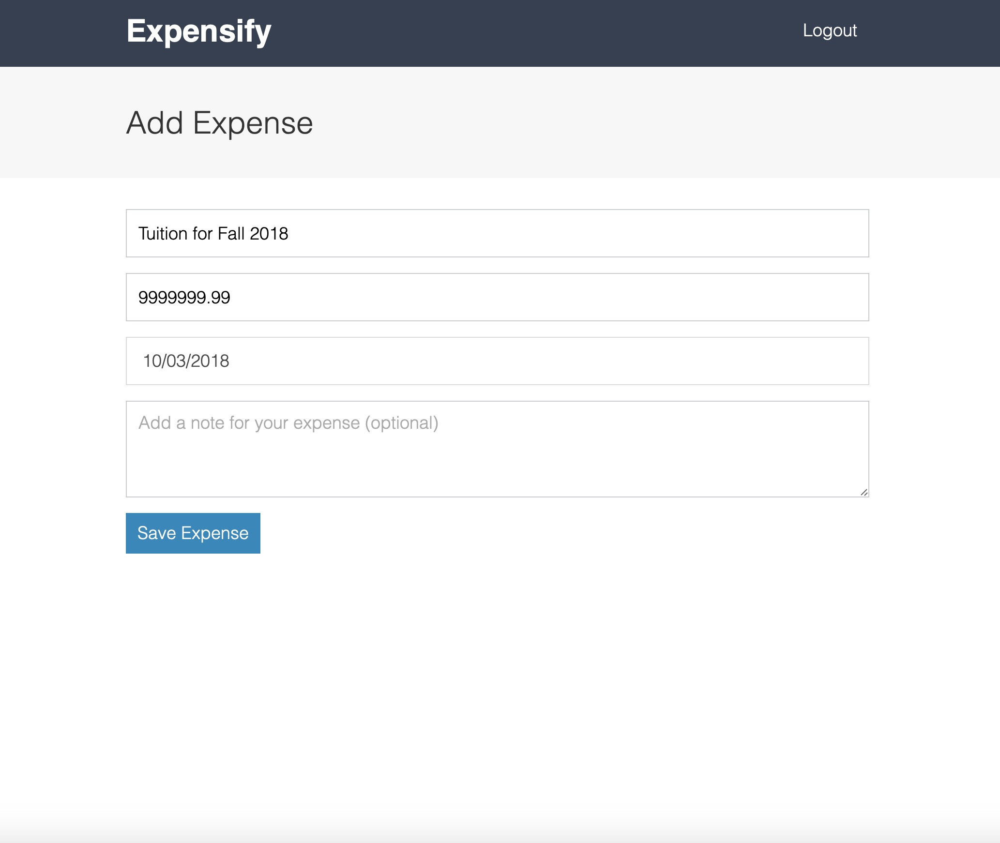
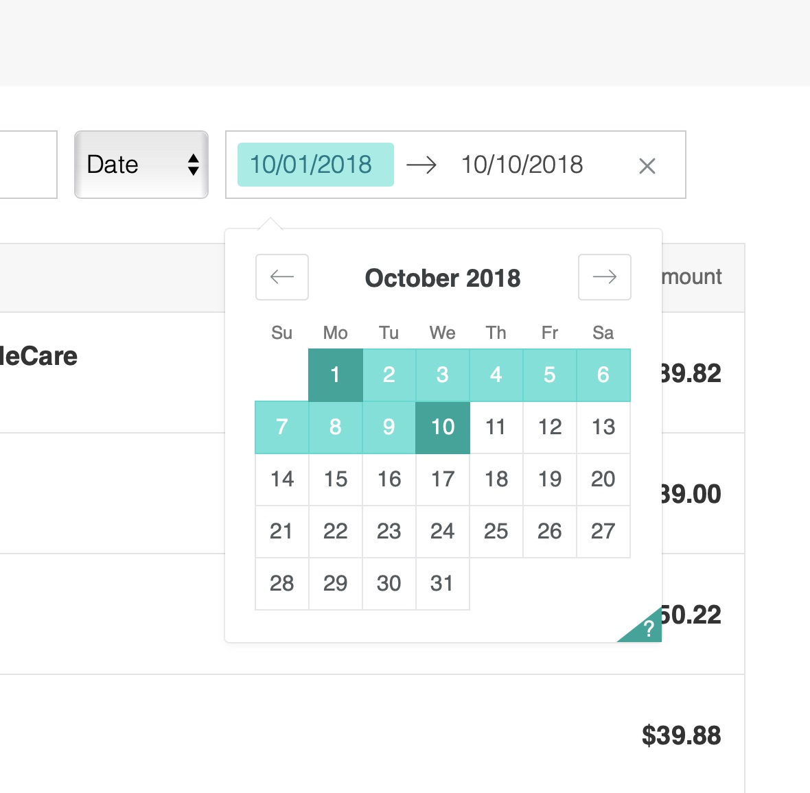

# React-Budget-App
This web app allows users to log, edit and view expenses concisely. The app incorporates React, Redux and uses firebase as the main database (using google email authentication). Tests were done with Jest and Enzyme. Credit to Andrew Mead, the author of the course.

## Login Page

## Dashboard

## Add Expense Page

## Edit/View Expense Page

## React Date Range Picker

